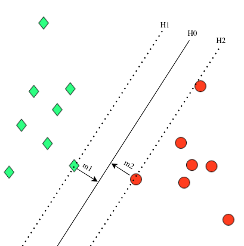
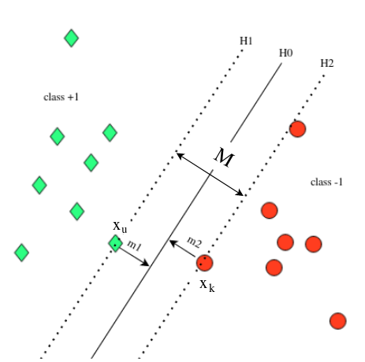

<!-- @import "[TOC]" {cmd="toc" depthFrom=1 depthTo=6 orderedList=false} -->

<!-- code_chunk_output -->

- [Giới Thiệu](#giới-thiệu)
- [Bài Toán Tối Ưu Cho SVM](#bài-toán-tối-ưu-cho-svm)
- [Tham số trả về từ SVC trong thư viện sklearn](#tham-số-trả-về-từ-svc-trong-thư-viện-sklearn)
- [Tài Liệu Tham Khảo](#tài-liệu-tham-khảo)

<!-- /code_chunk_output -->

# Giới Thiệu
Đã bao giờ bạn chạy một thuật toán hay một thư viện nào đó và kết quả trả về là một đống thứ mà bạn không hiểu nó là gì chưa, hay khi tìm hiểu thuật toán có những thứ nhỏ trong thuật toán mà ta vô tình bỏ qua dẫn tới không hiểu các thứ đằng sau nó vận hành? Cụ thể hơn, với bản thân mình khi chạy SVC trên thư viện scikit-learn ở cả một quá trình ban đầu, mình cũng hoang mang không biết các kết quả trả về từ thư viện như rho, obj, nSV hay nBSV là gì và mang ý nghĩa gì. Thì trong bài viết này chúng ta sẽ đi xâu hơn vào bên trong SVM cũng như cách thức để tối ưu nó. Vậy nên, Lets Go.

# Bài Toán Tối Ưu Cho SVM

Ta quay lại bài toán tối ưu cho SVM, giả sử đây là bài toán phân loại 2 lớp -1 và +1 (có thể phân tách tuyến tính) mà ở đó siêu phẳng H0 thỏa mãn $Wx + b = 0$ phân thành 2 không gian, không gian dữ liệu là lớp +1 với $x_{i}$ thỏa mãn $Wx_{i} + b >= 1$ và không gian là lớp -1 với $x_{j}$ thỏa mãn $Wx_{j} + b <= -1$.

gọi H1, H2 là 2 siêu phẳng biên đi qua các điểm support vector và song song với siêu phẳng H0 (Hình 1)

Khi đó, ta có:
\\[ WX + b = 1 ~~~~~~~~ X\in H1 \\]
\\[ WX + b = -1 ~~~~~ X\in H2 \\]

Hình 1: Siêu phẳng phân tách H0 và 2 siêu phẳng biên H1, H2 

giả sử, xét trong không gian 2 chiều và ta tìm được 3 phương trình đường thẳng tương ứng cho H0, H1, H2 là:

\\[ 6x_{1} + 3x_{2} + 7 = 0 ~~~~~ (x_{1}, x_{2})\in H0 \\]
\\[ 6x_{1} + 3x_{2} + 3 = 0 ~~~~~ (x_{1}, x_{2})\in H1 \\]
\\[ 6x_{1} + 3x_{2} + 11 = 0 ~~~~ (x_{1}, x_{2})\in H2 \\]
Chia cả 3 phương trình cho 4 ta được:
\\[ \frac{3}{2}x_{1} + \frac{3}{4}x_{2} + \frac{7}{4} = 0 ~~~~~ (x_{1}, x_{2})\in H0 \\]
\\[ \frac{3}{2}x_{1} + \frac{3}{4}x_{2} + \frac{7}{4} = 1 ~~~~~(x_{1}, x_{2})\in H1 \\]
\\[ \frac{3}{2}x_{1} + \frac{3}{4}x_{2} + \frac{7}{4} = -1 ~~~~~ (x_{1}, x_{2})\in H2   \\]
Do vậy, Đơn giản siêu phẳng H1, H2 được tạo ra bằng cách sử dụng phép dịch siêu phẳng H0.
\\[  W^{T}X + b = 0 ~~~~~ X\in H0 \\]
\\[ W^{T}X + b = 1 ~~~~~ X\in H1 \\]
\\[ W^{T}X + b = -1 ~~~~ X\in H2 \\]

Gọi \[ X_{u} \] là điểm nằm trên H1 và \[ X_{k} \] là điểm nằm trên H2.Khi đó, khoảng cách từ các điểm chạm từ các đường biên H1 và H2 tới H0 lần lượt sẽ là $m_{1}$ và $m_{2}$ và margin $M = m_{1} + m_{2}$

Hình 2: Margin trong SVM

Vì \[ X_{u} \in H1, X_{k} \in H2 \], Do vậy:
\\[  m1=\frac{|W^{T}X_{u}+b|}{||W||}=\frac{1}{||W||} ~~~~~~~~~~~ m2=\frac{|W^{T}X_{k}+b|}{||W||}=\frac{1}{||W||}  \\]
\\[ => M=m_{1} + m_{2}=\frac{2}{||W||} \\]

Do vậy, Mục tiêu của bài toán là đi tìm $W$ và $b$ sao cho:

**Cực đại hóa Margin**: **\[ M=\frac{2}{\|\|W\|\|} \]**

**Tương Đường Cực tiểu hóa**: **\[ \frac{1}{2}W^{T}W \]**

**Thỏa mãn**:
\\[ W^{T}X_{i} \ge 1 ~~~~~ ,if ~~ y_{i} = +1 \\]
\\[ W^{T}X_{i} \le -1 ~~~~ ,if ~~ y_{i} = -1 \\]
\\[ => \begin{array}{cc} y_{i}(W^{T}X_{i} + b) \ge 1 \end{array} \forall i \\]

Thực hiện giải bài toán tối ưu bậc 2 (Quadratic Programming) bằng phương pháp biến đổi Lagrangian. Về cơ bản, biến đổi Largrangian là việc nhân biểu thức với một bộ hệ số $\alpha$ với mỗi hệ số $\alpha_{i}$ (sẽ do ta chọn) sẽ gắn liền với từng phần tử của mẫu huấn luyện để kết hợp tuyến tính giữa hàm mục tiêu và các rằng buộc của nó.

Khi đó, hàm mục tiêu có dạng:

\\[  L_{p}(W, b, \alpha_{i}) = \frac{1}{2}W^{T}W - \sum_{i=1}^{n}\alpha_{i}(y_{i}(W^{T}X_{i}+b)-1) ~~~~~ s.t. ~~ \alpha_{i} \ge 0  \\]

Để tìm được giá trị nhỏ nhất của hàm $ L_{p}(W, b, \alpha_{i}) $ theo $ W $ và $ b$. Có thể thực hiện bằng cách giải hệ phương trình đạo hàm riêng theo $W$ và $b$:

ta có,

\\[ \frac{\partial L_{p}}{\partial W} = 0 ~~~~~ => ~~~~~ W = \sum_{i=1}^{n}\alpha_{i}y_{i}x_{i} \\]
\\[ \frac{\partial L_{p}}{\partial b} = 0 ~~ => ~~~~~ \sum_{i=1}^{n}\alpha_{i}y_{i} = 0  \\]

Thay vào hàm mục tiêu $ L_{p}(W, b, \alpha_{i}) $ ở trên:

\\[ g(\alpha) = \sum_{i=1}^{n}\alpha_{i} - \frac{1}{2}\sum_{i=1}^{n}\sum_{j=1}^{n}\alpha_{i}\alpha_{j}y_{i}y_{j}x_{i}^{T}x_{j} ~~~~~ s.t. ~~ \alpha_{i} \ge 0  \\]

$ g(\alpha) $ là một hàm **concave** do vậy để giải bài toán ta giải bài toán đối ngẫu của nó với các điều kiện rằng buộc của $\alpha$, ta có hàm mục tiêu:

**Maximize** \[ \sum_{i=1}^{n}\alpha_{i} - \frac{1}{2}\sum_{i=1}^{n}\sum_{j=1}^{n}\alpha_{i}\alpha_{j}y_{i}y_{j}x_{i}^{T}x_{j} ~~~~~ s.t. ~~ \alpha_{i} \ge 0 ~~ and ~~ \sum_{i=1}^{n}\alpha_{i}y_{i} = 0 (1) \]

Theo điều kiện KKT, ta có:

\\[ \alpha_{i}(y_{i}(W^{T}X_{i}+b)-1) = 0 ~~~~~ (2) \\]

Để biểu thức $ (2) $ bằng 0 thì $ (y_{i}(W^{T}X_{i}+b)-1) = 0 $ hoặc $ \alpha_{i} = 0 $, hay nói cách khác nếu trong trường hợp $ \alpha_{i} \neq  0 $ thì các điểm dữ liệu phải là các Support Vector (điểm dữ liệu nằm trên 2 đường biên) nơi mà phương trình đường thẳng có dạng $ W^{T}X_{i} + b = \pm 1 $.

Khi đó,

\\[ W = \sum_{i=1}^{n}\alpha_{i}y_{i}x_{i} = \sum_{i \in SV}\alpha_{i}y_{i}x_{i} ~~~~~ (3) \\]
\\[~~~~~~~~~~~~~~~~~~~~~~~~~~~~~~~~~~~~~~~~~~~~~~~~~~~~~~~~~~~~~~~~~~~~~~~~~~~~~~~~~~~~~~~~~~~~~~~ s.t. ~~ (x_{i}\ is\ support\ vector)  \\]
\\[ b = \frac{1}{y_{i}} - W^{T}x_{i} = y_{i} - W^{T}x_{i} ~~~~ (4) \\]

Do vậy, Để giải quyết được bài toán, tìm được bộ tham số $ W\  và\ b $ ta chỉ cần tìm được Support Vector. Vì hệ số Largrangian $ \alpha_{i} $ ta có thể tìm được bằng cách tối ưu biểu thức $ (1) $.

Khi đó, với mỗi một điểm dữ liệu $x$, việc xác định xem điểm liệu đó thuộc vào class nào, ta cần xác định dấu của biểu thức:

\\[ g(x) = W^{T}X + b = \sum_{i \in SV}\alpha_{i}x_{i}^{T}x + b ~~~~~ (5) \\]

Vậy, làm sao để có thể xác định được các điểm dữ liệu Support Vector $x_{i}$ ? Thì ở đây ta sẽ dùng một phương pháp thử và sai. Có nghĩa là, trong quá trình học với mỗi class ta chọn một điểm $x_{i}\ và\ x_{j}$ làm Support Vector và thay vào phương trình $(5)$ để tính $g(x)$ cho tất cả các điểm dữ liệu thuộc từng class tương ứng. Nếu mọi điểm dữ liệu cho ra kết quả $g(x)$ thuộc đúng class tương ứng của nó thì điểm $x_{i}\ và\ x_{j}$ đó sẽ được chọn làm Support Vector(Trong bài toán soft-margin ta sẽ chấp nhận một số điểm dữ liệu nhiễu cho ra $g(x)$ sai với class để thu được siêu phẳng phân tách tốt hơn và dùng hệ số $C$ để kiểm soát số lượng nhiễu trong mỗi điểm dữ liệu). Khi đó, sẽ có nhiều điểm Support Vector thỏa mãn thì ta sẽ thử và chọn nhiều điểm dữ liệu khác nhau làm Support Vector và những điểm dữ liệu nào nằm trên đường thẳng (đều là support vector) mà đạt được $Margin\  M$ lớn nhất thì đó chính là các điểm support vector cần tìm.

# Tham số trả về từ SVC trong thư viện sklearn

Ok, sau khi nói tràn lan đại hải ở trên cũng tới phần nói tới các tham số trả về từ SVC trong sklean. Sklearn, mình nghĩ không lạ gì với các bạn tìm hiểu về machine learning nữa rồi. Mặc dù dùng, tuy nhiên với một đứa đần như mình có những hàm của sklearn trả về những tham số mà mình chả hiểu nó là kiểu gì và đôi khi mình kiểu "kệ bà nó" cứ thế mà dùng thôi =)). Rồi sau mình mới có thời gian tìm hiểu lại và đọc lại kỹ hơn để hiểu những thứ đó, trong số đó thì tham số trả về của SVC là một ví dụ điển hình.

Đôi khi train SVC xong ta sẽ nhận được một đống param trả về như này:

optimization finished, **#iter** = 87 
**nu** = 0.471645 
**obj** = -67.299458, rho = 0.203495 
**nSV** = 88, nBSV = 72 
**Total nSV** = 88 

Ở đây

**iter**: Thể hiện số lần lặp để thuật toán hội tụ 
**nu**  : Là một hệ số với chức năng tương tự như C trong soft-margin 
**obj** : Là giá trị của hàm mục tiêu của bài toán đối ngẫu biểu thức (1) ở trên 
**rho** : Là hệ số bias (b) trong hàm xác định class của điểm dữ liệu trong biểu thức (5) 
**nSV** : Là số lượng của Support Vectors 
**nBSV**: Là số lượng của Bounded Support Vectors (là $\alpha_{i}=0$ ở điều kiện KKT (2)) 

# Tài Liệu Tham Khảo
[1] Chang and Lin, "LIBSVM: A Library for Support Vector Machines", 2001 
[2] [series support vector machine - machinelearningcoban - Tiệp Vũ](https://machinelearningcoban.com/2017/04/09/smv/#-gioi-thieu) 
[3] [sklearn.svm.SVC](scikit-learn.org/stable/modules/generated/sklearn.svm.SVC.html) 
